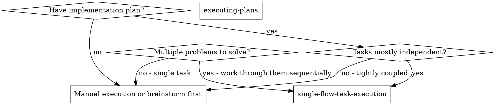
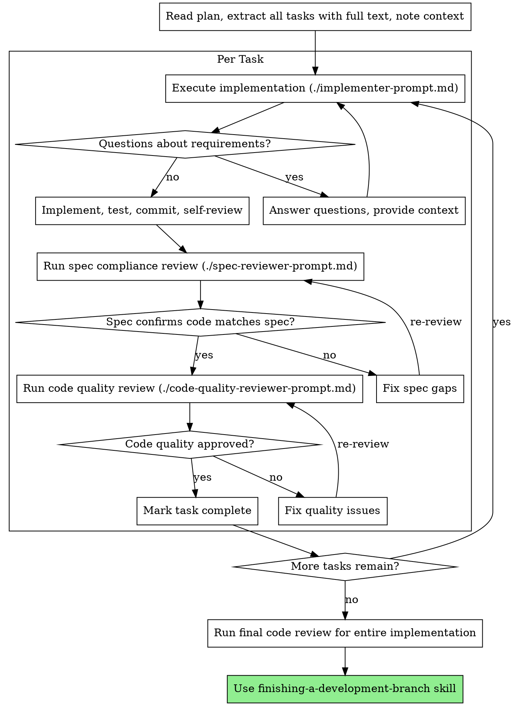

# Single-Flow Task Execution

Execute plans by working through one task at a time with two-stage review after each: spec compliance review first, then code quality review.

**Core principle:** One task at a time + two-stage review (spec then quality) = high quality, disciplined iteration.

## Execution Model

All work happens in a single execution thread. No parallel task dispatch.

**Rules:**

1. **One active task only** — never work on multiple tasks simultaneously.
2. **One execution thread only** — no parallel dispatch.
3. **Sequential execution** — complete one task fully before starting the next.
4. **Browser automation** may use the `Task` tool in isolated steps when needed.
5. **Track progress** by updating task tracker at each state change.

## When to Use



**Use when:**

- You have an implementation plan with multiple independent tasks
- 2+ test files failing with different root causes (work through them one at a time)
- Multiple subsystems broken independently
- Each problem can be understood without context from others
- Structured execution with quality gates is needed

**Don't use when:**

- Failures are related (fix one might fix others) — investigate together first
- Tasks are tightly coupled and need full system understanding
- Single simple task that doesn't need review structure

**vs. Executing Plans (worktree-based):**

- Same session (no context switch)
- Clean scope per task
- Two-stage review after each task: spec compliance first, then code quality
- Faster iteration (no human-in-loop between tasks)

## The Process



## Task Decomposition

When facing multiple problems (e.g., 5 test failures across 3 files):

### 1. Identify Independent Domains

Group failures by what's broken:

- File A tests: User authentication flow
- File B tests: Data validation logic
- File C tests: API response handling

Each domain is independent — fixing authentication doesn't affect validation tests.

### 2. Create Task Units

Each task gets:

- **Specific scope:** One test file or subsystem
- **Clear goal:** Make these tests pass / implement this feature
- **Constraints:** Don't change unrelated code
- **Expected output:** Summary of what changed and verification results

### 3. Execute Sequentially with Review

Work through each task one at a time using the full review cycle.

### 4. Review and Integrate

After all tasks:

- Run full test suite to verify no regressions
- Check for conflicts between task changes
- Run final code review on entire implementation

## Task Brief Structure

For each task, prepare:

```
## Task N: [task name]

### Task Description
[FULL TEXT of task from plan — paste it here]

### Context
[Where this fits, dependencies, architectural context]

### Constraints
- Only modify [specific files/directories]
- Follow existing patterns in the codebase
- Write tests for new functionality

### Verification
- Run: [specific test command]
- Expected: [what success looks like]
```

**Key:** Provide full task text and context upfront.

## Review Templates

This skill includes prompt templates for structured reviews:

- **`./implementer-prompt.md`** — Template for implementation tasks
- **`./spec-reviewer-prompt.md`** — Template for spec compliance review (did we build what was requested?)
- **`./code-quality-reviewer-prompt.md`** — Template for code quality review (is it well-built?)

**Review order matters:** Always run spec compliance FIRST, then code quality. There's no point reviewing code quality if the implementation doesn't match the spec.

## Checkpoint Pattern

At logical boundaries (after each task, at major milestones), report:

- **What changed** — files modified, features implemented
- **What verification ran** — test results, lint results
- **What remains** — remaining tasks, known issues

## Common Mistakes

**Task scoping:**

- **Bad:** "Fix all the tests" — loses focus
- **Good:** "Fix user-auth.test.ts failures" — clear scope

**Context:**

- **Bad:** "Fix the validation bug" — unclear where
- **Good:** Paste error messages, test names, relevant code paths

**Constraints:**

- **Bad:** No constraints — task might refactor everything
- **Good:** "Only modify src/auth/ directory"

**Reviews:**

- **Bad:** "It works, move on" — quality debt
- **Good:** Implement then spec review then quality review then next task

## Red Flags

**Never:**

- Start implementation on main/master branch without explicit user consent
- Skip reviews (spec compliance OR code quality)
- Proceed with unfixed review issues
- Work on multiple tasks simultaneously
- Accept "close enough" on spec compliance
- **Start code quality review before spec compliance passes** (wrong order)
- Move to next task while either review has open issues

**If reviewer finds issues:**

- Fix them
- Run reviewer again
- Repeat until approved
- Don't skip the re-review

## Completion

Before claiming all work is done:

1. Ensure all tasks are marked `done` or `cancelled`
2. Run full test/validation command
3. Verify no regressions across all tasks
4. Summarize evidence (test output, review approvals)

## Integration

**Required workflow skills:**

- **using-git-worktrees** — Set up isolated workspace before starting
- **writing-plans** — Creates the plan this skill executes
- **requesting-code-review** — Code review template for quality reviews
- **finishing-a-development-branch** — Complete development after all tasks

**Should also use:**

- **test-driven-development** — Follow TDD for each task
- **verification-before-completion** — Final verification checklist

**Alternative workflow:**

- **executing-plans** — Use for worktree-based batch execution
