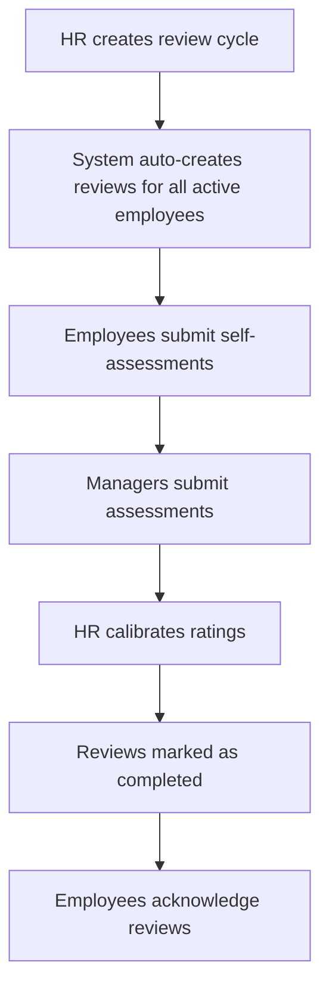
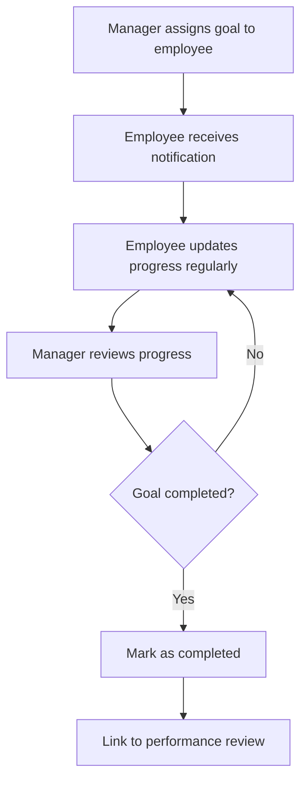
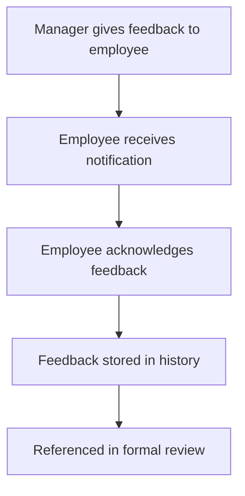

# SPEC — Performance Management System

> This file is the single source of truth for Performance Management features.
> Implementation must NOT deviate from any contract defined here.
> If anything is unclear, STOP and ask before implementing.

## Principles

- **Fairness & Transparency**: Performance evaluations must be objective, documented, and accessible to relevant parties
- **Continuous Feedback**: Support both formal reviews and ongoing feedback mechanisms
- **Goal Alignment**: Individual goals should align with team and company objectives
- **Data-Driven Decisions**: Performance data should inform promotion, compensation, and development decisions

## Scope

### Phase 1 - Core Performance Management

- Performance review cycles (quarterly, semi-annual, annual)
- Goal setting and tracking (OKRs/KPIs)
- Self-assessment and manager assessment
- Review templates and rating scales
- Performance history tracking
- Basic analytics and reports

### Out of Scope (Future Phases)

- 360-degree feedback (peer, subordinate reviews)
- Competency frameworks
- Succession planning
- Performance improvement plans (PIP)
- Integration with compensation/promotion workflows
- AI-powered performance insights

## Entities & Data Model

### `performance_review_cycles`

Defines review periods for the organization.

Fields:

- `id` primary key
- `name` string (e.g., "Q1 2026 Performance Review")
- `cycle_type` enum: `quarterly`, `semi_annual`, `annual`, `probation`
- `start_date` date
- `end_date` date
- `review_period_start` date (period being reviewed)
- `review_period_end` date
- `status` enum: `draft`, `active`, `completed`, `cancelled`
- `self_assessment_deadline` nullable date
- `manager_assessment_deadline` nullable date
- `calibration_deadline` nullable date
- `created_by` foreign key to `users`
- timestamps

Contract:

- Only one `active` cycle per `cycle_type` at a time
- `review_period_end` must be before `start_date`
- Deadlines must be within cycle `start_date` and `end_date`

### `performance_reviews`

Individual performance review records.

Fields:

- `id` primary key
- `cycle_id` foreign key to `performance_review_cycles`
- `employee_id` foreign key to `employee_profiles`
- `reviewer_id` foreign key to `employee_profiles` (manager)
- `status` enum: `pending_self`, `pending_manager`, `pending_calibration`, `completed`, `cancelled`
- `self_assessment_submitted_at` nullable timestamp
- `manager_assessment_submitted_at` nullable timestamp
- `final_rating` nullable decimal(3,2) (e.g., 4.50 out of 5.00)
- `final_rating_label` nullable string (e.g., "Exceeds Expectations")
- `calibrated_at` nullable timestamp
- `calibrated_by` nullable foreign key to `users`
- `completed_at` nullable timestamp
- `acknowledged_by_employee_at` nullable timestamp
- timestamps

Contract:

- One review per employee per cycle
- `reviewer_id` should be employee's direct manager at time of review
- Status transitions: `pending_self` → `pending_manager` → `pending_calibration` → `completed`
- Employee can only acknowledge after review is `completed`

### `performance_review_sections`

Template sections for reviews (e.g., "Technical Skills", "Communication", "Leadership").

Fields:

- `id` primary key
- `name` string
- `description` text
- `weight` decimal(5,2) (percentage weight in overall rating, e.g., 25.00)
- `order` integer
- `is_active` boolean default true
- timestamps

Contract:

- Total weight of active sections should equal 100.00
- Sections are global and apply to all reviews

### `performance_review_responses`

Actual responses for each section in a review.

Fields:

- `id` primary key
- `review_id` foreign key to `performance_reviews`
- `section_id` foreign key to `performance_review_sections`
- `self_rating` nullable integer (1-5 scale)
- `self_comments` nullable text
- `manager_rating` nullable integer (1-5 scale)
- `manager_comments` nullable text
- `final_rating` nullable integer (1-5 scale, after calibration)
- timestamps

Contract:

- One response per review per section
- Ratings must be between 1 and 5
- `final_rating` defaults to `manager_rating` unless calibrated

### `performance_goals`

Individual goals/objectives for employees.

Fields:

- `id` primary key
- `employee_id` foreign key to `employee_profiles`
- `title` string
- `description` text
- `goal_type` enum: `okr`, `kpi`, `development`, `project`
- `category` nullable string (e.g., "Technical", "Leadership", "Business")
- `target_value` nullable string (for measurable goals)
- `current_value` nullable string
- `unit` nullable string (e.g., "%", "count", "hours")
- `weight` nullable decimal(5,2) (importance weight)
- `start_date` date
- `due_date` date
- `status` enum: `not_started`, `in_progress`, `at_risk`, `completed`, `cancelled`
- `completion_percentage` integer default 0 (0-100)
- `created_by` foreign key to `users`
- `assigned_by` nullable foreign key to `employee_profiles` (manager)
- `linked_review_id` nullable foreign key to `performance_reviews`
- timestamps

Contract:

- Goals can be self-created or manager-assigned
- Goals linked to reviews are evaluated during that review cycle
- `completion_percentage` must be 0-100

### `performance_goal_updates`

Progress updates on goals.

Fields:

- `id` primary key
- `goal_id` foreign key to `performance_goals`
- `updated_by` foreign key to `users`
- `update_type` enum: `progress`, `status_change`, `completion`
- `previous_value` nullable string
- `new_value` nullable string
- `previous_status` nullable string
- `new_status` nullable string
- `completion_percentage` nullable integer
- `notes` nullable text
- timestamps

Contract:

- Automatically created when goal status or values change
- Provides audit trail for goal progress

### `performance_feedback`

Continuous feedback outside formal reviews.

Fields:

- `id` primary key
- `employee_id` foreign key to `employee_profiles` (recipient)
- `given_by` foreign key to `employee_profiles`
- `feedback_type` enum: `positive`, `constructive`, `general`
- `category` nullable string (e.g., "Communication", "Technical Skills")
- `content` text
- `is_private` boolean default false (visible only to employee and their manager)
- `acknowledged_at` nullable timestamp
- `linked_goal_id` nullable foreign key to `performance_goals`
- timestamps

Contract:

- Feedback can be given by managers, peers (future), or self
- Private feedback only visible to employee, their manager, and HR
- Public feedback visible to employee and their reporting chain

## Rating Scale

Default 5-point scale:

- 5 = Outstanding / Exceptional
- 4 = Exceeds Expectations
- 3 = Meets Expectations
- 2 = Needs Improvement
- 1 = Unsatisfactory

Overall review rating is weighted average of section ratings.

## Permissions & Access Control

### Roles

- **Employee**: Can view own reviews, submit self-assessments, create/update own goals, acknowledge reviews
- **Manager**: Can create reviews for direct reports, submit manager assessments, create/assign goals to team, view team performance
- **HR**: Can create review cycles, view all reviews, calibrate ratings, access analytics
- **Finance**: No direct access (future: may view for compensation decisions)

### Permission Matrix

| Action                    | Employee | Manager            | HR      | Finance |
| ------------------------- | -------- | ------------------ | ------- | ------- |
| View own reviews          | ✓        | ✓                  | ✓       | -       |
| Submit self-assessment    | ✓        | ✓                  | ✓       | -       |
| View team reviews         | -        | ✓                  | ✓       | -       |
| Submit manager assessment | -        | ✓                  | ✓       | -       |
| Create review cycle       | -        | -                  | ✓       | -       |
| Calibrate ratings         | -        | -                  | ✓       | -       |
| View analytics            | -        | ✓ (team only)      | ✓ (all) | -       |
| Create own goals          | ✓        | ✓                  | ✓       | -       |
| Assign goals to others    | -        | ✓ (direct reports) | ✓       | -       |
| Give feedback             | ✓        | ✓                  | ✓       | -       |
| View feedback received    | ✓        | ✓                  | ✓       | -       |

## User Flows

### Flow 1: Annual Review Cycle

### Flow 2: Goal Setting

### Flow 3: Continuous Feedback

## API Endpoints

### Review Cycles

- `GET /api/v1/performance/cycles` - List review cycles (HR only)
- `POST /api/v1/performance/cycles` - Create cycle (HR only)
- `GET /api/v1/performance/cycles/{id}` - Get cycle details
- `PATCH /api/v1/performance/cycles/{id}` - Update cycle (HR only)
- `POST /api/v1/performance/cycles/{id}/activate` - Activate cycle (HR only)
- `POST /api/v1/performance/cycles/{id}/complete` - Complete cycle (HR only)

### Reviews

- `GET /api/v1/performance/reviews/my-reviews` - Employee's own reviews
- `GET /api/v1/performance/reviews/team-reviews` - Manager's team reviews
- `GET /api/v1/performance/reviews/{id}` - Get review details
- `POST /api/v1/performance/reviews/{id}/self-assessment` - Submit self-assessment
- `POST /api/v1/performance/reviews/{id}/manager-assessment` - Submit manager assessment
- `POST /api/v1/performance/reviews/{id}/calibrate` - Calibrate rating (HR only)
- `POST /api/v1/performance/reviews/{id}/acknowledge` - Employee acknowledges review

### Goals

- `GET /api/v1/performance/goals/my-goals` - Employee's goals
- `GET /api/v1/performance/goals/team-goals` - Manager's team goals
- `POST /api/v1/performance/goals` - Create goal
- `GET /api/v1/performance/goals/{id}` - Get goal details
- `PATCH /api/v1/performance/goals/{id}` - Update goal
- `POST /api/v1/performance/goals/{id}/update-progress` - Add progress update
- `DELETE /api/v1/performance/goals/{id}` - Delete goal

### Feedback

- `GET /api/v1/performance/feedback/received` - Feedback received by employee
- `GET /api/v1/performance/feedback/given` - Feedback given by user
- `POST /api/v1/performance/feedback` - Give feedback
- `POST /api/v1/performance/feedback/{id}/acknowledge` - Acknowledge feedback

### Analytics

- `GET /api/v1/performance/analytics/team-summary` - Team performance summary (Manager)
- `GET /api/v1/performance/analytics/company-summary` - Company-wide summary (HR)
- `GET /api/v1/performance/analytics/rating-distribution` - Rating distribution (HR)
- `GET /api/v1/performance/analytics/goal-completion-rate` - Goal completion metrics

## Notifications

### Review Notifications

- Employee: "Your Q1 2026 performance review is ready for self-assessment"
- Manager: "Self-assessment completed by [Employee Name]"
- Employee: "Your performance review has been completed by [Manager Name]"
- HR: "All reviews for Q1 2026 cycle are ready for calibration"

### Goal Notifications

- Employee: "New goal assigned: [Goal Title]"
- Manager: "[Employee Name] updated progress on [Goal Title]"
- Employee: "Goal deadline approaching: [Goal Title] due in 7 days"

### Feedback Notifications

- Employee: "You received new feedback from [Manager Name]"

## Validation Rules

### Review Cycle

- `end_date` must be after `start_date`
- `review_period_end` must be before `start_date`
- Cannot activate cycle if another cycle of same type is already active
- Cannot complete cycle if any reviews are still `pending_self` or `pending_manager`

### Performance Review

- Self-assessment can only be submitted before `self_assessment_deadline`
- Manager assessment can only be submitted after self-assessment is complete
- Employee can only acknowledge after review status is `completed`
- Cannot delete review once any assessment is submitted

### Goals

- `due_date` must be after `start_date`
- `completion_percentage` must be 0-100
- Cannot delete goal if linked to a completed review
- Weight must be positive number

### Feedback

- Cannot give feedback to yourself
- Content must not be empty
- Cannot edit feedback after 24 hours of creation

## Test Scenarios

### Review Cycle Tests

1. HR creates annual review cycle successfully
2. System auto-creates reviews for all active employees
3. Cannot activate cycle when another cycle of same type is active
4. Cannot complete cycle with pending reviews

### Review Flow Tests

1. Employee submits self-assessment before deadline
2. Manager cannot submit assessment before employee self-assessment
3. HR calibrates rating and review is marked completed
4. Employee acknowledges completed review
5. Late self-assessment is rejected after deadline

### Goal Tests

1. Manager assigns goal to employee
2. Employee updates goal progress
3. Goal completion triggers notification
4. Goal linked to review is evaluated in that cycle
5. Cannot delete goal linked to completed review

### Feedback Tests

1. Manager gives positive feedback to employee
2. Employee acknowledges feedback
3. Private feedback only visible to authorized users
4. Feedback cannot be edited after 24 hours

### Analytics Tests

1. Manager views team performance summary
2. HR views company-wide rating distribution
3. Goal completion rate calculated correctly
4. Rating distribution matches actual review data

## Integration Points

### Existing Systems

- **Employee Management**: Reviews and goals linked to employee profiles
- **Team Management**: Manager access based on team membership
- **Notifications**: All performance events trigger notifications
- **Analytics Dashboard**: Performance metrics integrated into HR analytics

### Future Integrations

- **Payroll**: Performance ratings inform compensation adjustments
- **Promotion Workflow**: Review history used in promotion decisions
- **Learning & Development**: Performance gaps trigger training recommendations

## Assumptions & Constraints

- Review cycles are company-wide (not team-specific in Phase 1)
- Rating scale is fixed 1-5 (customization in future phase)
- Only direct manager can review employee (no skip-level reviews in Phase 1)
- Goals are individual (team goals in future phase)
- Feedback is text-only (no attachments in Phase 1)
- All dates and deadlines are in company timezone
- Performance data retained indefinitely for historical analysis
